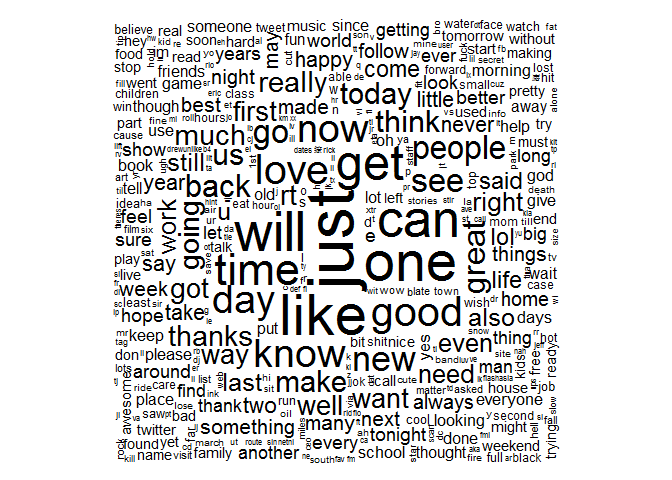
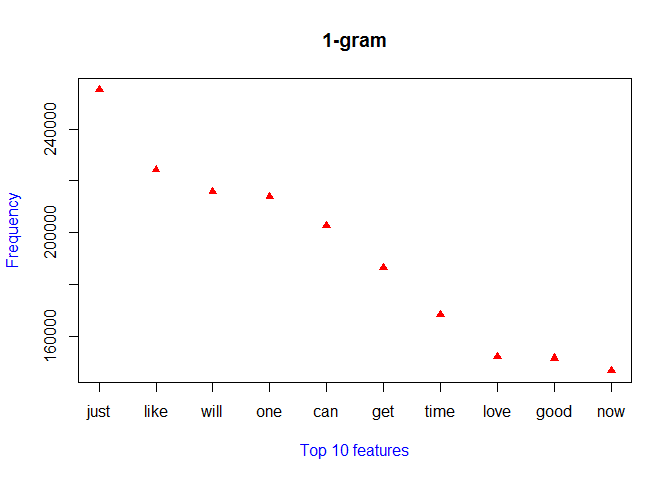

# Final_W2
Hsing-Yi  
2016年4月24日  
# Background:
Around the world, people are spending an increasing amount of time on their mobile devices for email, social networking, banking and a whole range of other activities. But typing on mobile devices can be a serious pain.  SwiftKey, our corporate partner in this capstone, builds a smart keyboard that makes it easier for people to type on their mobile devices. One cornerstone of their smart keyboard is predictive text models.

# Purpose:
Build a predictive text models which is able to perform the capabilities : 
When someone types: "I like to" ..,  then presents three options for what the next word might be.  such as "think", "say"", "go".

# Overall Steps:
A text mining analysis involves several challenging process steps mainly influenced by the
fact that texts, from a computer perspective, are rather unstructured collections of words.

## Data loading 
Loaded data requested in the project into R environment: including : en_US.twitter.txt , en_US.news.txt, en_US.blogs.txt


```r
library("quanteda")
```

### Data Loading 

```r
DT_Twitter <- readLines("C:/Users/user/Documents/datasciencecouresa/Final project/final/en_US/en_US.twitter.txt", n = -1L, ok = TRUE, warn = TRUE,encoding = "unknown", skipNul = FALSE)

DT_News <- readLines("C:/Users/user/Documents/datasciencecouresa/Final project/final/en_US/en_US.news.txt", n = -1L, ok = TRUE, warn = TRUE,encoding = "unknown", skipNul = FALSE)

DT_Blogs <- readLines("C:/Users/user/Documents/datasciencecouresa/Final project/final/en_US/en_US.blogs.txt", n = -1L, ok = TRUE, warn = TRUE,encoding = "unknown", skipNul = FALSE)
```

## Data Pre-processing and cleansing : 
The second step is tidying up the texts, including preprocessing the texts to obtain a convenient representation
for later analysis. This step might involve text reformatting (e.g., whitespace removal),Journal of Statistical Software
stopword removal, or stemming procedures. Then to transform the preprocessed texts into structured formats to be actually
computed with. For “classical” text mining tasks, this normally implies the creation of a so-called term-document matrix,
probably the most common format to represent texts for computation. Then  the analyst can
work and compute on texts with standard techniques from statistics and data mining, like
clustering or classification methods.
There is a need for a conceptual entity similar to a database
holding and managing text documents in a generic way: we call this entity a text document
collection or corpus.

### Create Corpus for Twitter , News and Blogs data sets

```r
corpus1 <- corpus(DT_Twitter)
corpus2 <- corpus(DT_News)
corpus3 <- corpus(DT_Blogs)
corpus_sum <- corpus1 + corpus2 + corpus3
```

### Check text count by each corpus

```r
sum(nchar(texts(corpus1)))
```

```
## [1] 162197613
```

```r
sum(nchar(texts(corpus2)))
```

```
## [1] 15640877
```

```r
sum(nchar(texts(corpus3)))
```

```
## [1] 206869471
```

```r
sum(nchar(texts(corpus_sum)))
```

```
## [1] 384707961
```

Total 387M text collected.


### Create n-grams Tokenization and transfer to dfm (Document Feature Matrix) 

Take Twitter, News and Blog to do data exploratory


```r
mydfm <- dfm(corpus_sum, verbose = TRUE, toLower = TRUE, removeTwitter = TRUE, removeNumbers = TRUE, ignoredFeatures = stopwords("english"))
```

```
## Creating a dfm from a corpus ...
##    ... lowercasing
##    ... tokenizing
##    ... indexing documents: 3,336,695 documents
##    ... indexing features: 659,290 feature types
##    ... removed 174 features, from 174 supplied (glob) feature types
##    ... created a 3336695 x 659116 sparse dfm
##    ... complete. 
## Elapsed time: 237.68 seconds.
```

```r
stat <- c(ndoc(corpus_sum),ndoc(mydfm), nfeature(mydfm))
names(stat) <- c("Doc. cnt of Corpus_Sum", "Doc. cnt of 1-gram", "Fea. Cnt of 1-gram")
stat
```

```
## Doc. cnt of Corpus_Sum     Doc. cnt of 1-gram     Fea. Cnt of 1-gram 
##                3336695                3336695                 659116
```

## Data Exploratory


### Plot wordclouds by dataset

```r
plot(mydfm, min.freq = 100, random.order = FALSE)             # word cloud     
```



### word frequency distribution

```r
topfeatures(mydfm, 10)  
```

```
##   just   like   will    one    can    get   time   love   good    now 
## 255202 224233 215730 213946 202616 186299 168166 152075 151340 146595
```

```r
plot(topfeatures(mydfm, 10), col = "red", pch = 17, xlab = "Top 10 features", ylab = "Frequency", xaxt = "n", col.lab="blue")
title("1-gram")
axis(side = 1, at = c(1:10) , labels = names(topfeatures(mydfm,10)))
```



### Detect the collocations from text

```r
col_corpus <- collocations (corpus_sum, method="lr")
col_corpus
```

```
##           word1  word2 word3  count           G2
##       1:     in    the       243605 5.073564e+05
##       2:      i     am        72008 4.561694e+05
##       3:     of    the       256929 4.443943e+05
##       4:     to     be       118497 3.599454e+05
##       5:     if    you        66505 3.281909e+05
##      ---                                        
## 8525473:    why  roses            1 1.200066e-01
## 8525474: fixing   make            1 1.200065e-01
## 8525475:  gates   make            1 1.200065e-01
## 8525476:  tryin   make            1 1.200065e-01
## 8525477: second impact            1 1.200065e-01
```


## Algorithm/ Application
The project requests a online application to predict the nearest 1 to 3 words based on user's input.
 The steps includes:
1) Preprocessing the text
2) Tokenization and prepare unigram, bigram from the data
3) Count the occurences of unigram, bigram
4) Get the text input from user
5) Extract the last two words
6) Calculate the probability of the possible match
7) Return the top 3 predicted words
